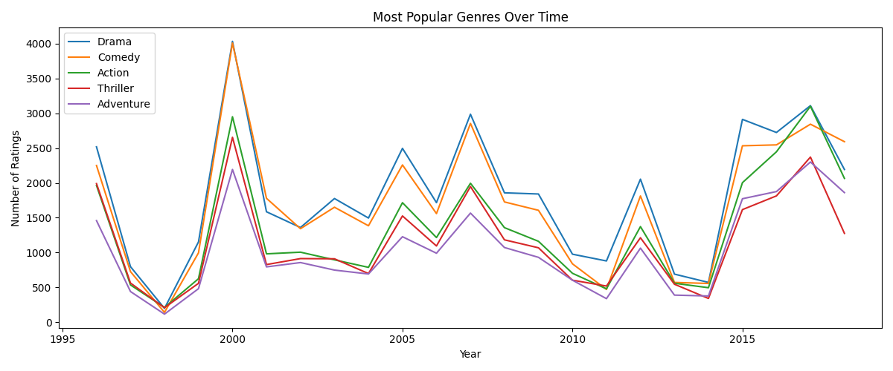
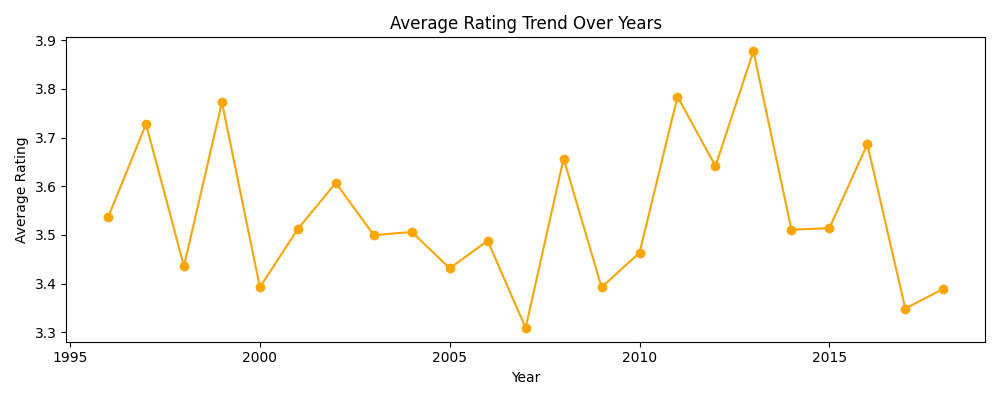
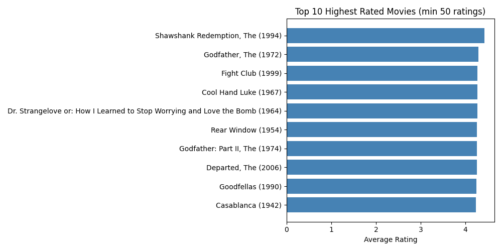

# Task 14 - Movie Trend Analytics

## Dataset
MovieLens Latest Small
https://grouplens.org/datasets/movielens/

## Tools Used
- Python (pandas, matplotlib)
- Google Colab

## Tasks Performed
1. Most Popular Genres Over Time
2. Average Rating Trends by Year  
3. Top 10 Highest Rated Movies

## Results

